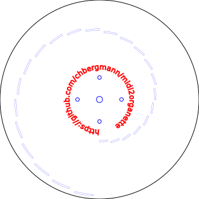

# midi2organette
Create discs for Ariston organettes  
Music file import in midi format is supported.  
The output is SVG format. This can be used as input for for lasercutters.

STATE: unfinished !
  

## Prerequisites
You need [Python 3](https://www.python.org)  
Install Mido and svgwrite

	pip install mido
	pip install svgwrite

## Usage
	./midi2organette.py 
		-mid <midifile.mid>    input Midi file
		-svg <svgfile.svg>     output SVG file
		-start <ms>            skip milliseconds at start
		-end <ms>              stop after milliseconds
		-pause <ms>            add milliseconds silence to the end
		-transpose <halftones> transpose halftones up (negative value for down)
		-text <text>           draw text onto the disc
	
### Example
This will create a disc with the first 45 seconds of mysong.mid with a half second pause at the end. It tries to transpose the song to match all notes that the instrument supports.

	./midi2organette -mid mysong.mid -svg disc.svg -end 45000 -pause 500 -auto

### Test disk
If the parameter -mid is missing, a test disk will be created

	./midi2organette.py -text "Ariston Testscheibe" -svg AristonTestdisk.svg

